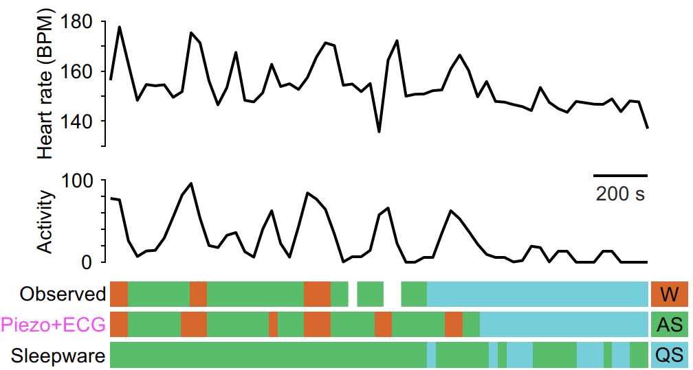

# Sleep Stage Classification
## Overview
We developed and trained three models based on ECG data, piezo data and the combination of both signals.

1. Relevant features were first extracted from the two signals.
2. These features for each 30s epoch served as a basis to train Support Vector Machines (SVM).
3. The trained models were then applied to different data sets to test their applicability and generalisation capability.
4. Finally, a comprehensive evaluation was carried out to assess the performance of the models.
<p align="center">

</p>

The heart rate (BPM: beats per minute) and activity (short, moving average over one minute) from a 30-minute recording are displayed as examples. Below, the manually annotated sleep stages (observed Dataset B), the predictions from the piezo+ECG model, and the classifications from the Sleepware G3 (Philips) sleep lab software are shown for comparison.

## Data
We used 28 PSG data sets from preterm infants.
ECG (200 Hz) and piezo signal (200 Hz) were extracted from these data sets.

The probands had a gestational age at birth of 27-34 weeks and a postmenstrual age at measurement with a median of 35.5 weeks.

Due to data protection restrictions, the data cannot be published.
## Code
- `preprocessing/` Scripts for filtering signals and removing noise.
- `data_analysis/` Calculate statistical measures like Cohen's kappa to evaluate agreement.
- `feature_extraction/` Extract features from ECG and piezo signals, such as heart rate variability (HRV) and movement patterns.
- `SVM/` Build, train, and test Support Vector Machine (SVM) models.
- `sleep_analysis/`  Analyze sleep data, including calculating average sleep duration and the distribution of sleep stages.
- `models/` Store trained models used for testing on different datasets.
- `plots/` Generate plots and visualizations of results, such as performance metrics and analysis outcomes.


## Dependencies
`requirements.txt` contains all the packages that are related to the project.
## Citation
The work can be cited using below citation information.
```
Demme, N., Shadaydeh, M., Schieder, L., Doerfel, C., Jähkel, S., Holthoff, K., Proquitté, H., Denzler, J., Graf, J. (2025). Towards unobtrusive sleep stage classification in preterm infants using machine learning. In: Biomedical Signal Processing and Control
```

or as bib entry
```bibtex
@article{DemmeSleepClassification2025,
    author="Demme, Nathalie and Shadaydeh, Maha and Schieder, Laura and Doerfel, Claus and J{\"a}hkel, Stella and Holthoff, Knut and Proquitté, Hans and Denzler, Joachim and Graf, J{\"u}rgen",
    journal="Biomedical Signal Processing and Control",
    title="Towards unobtrusive sleep stage classification in preterm infants using machine learning",
    year="2025",
}

```
